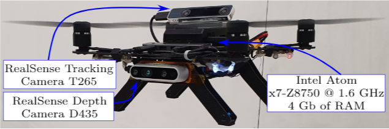

Framework for Autonomous Navigation of Micro Aerial Vehicles
===============

This package provides the implementation of a framework for autonomous drone navigation towards a given goal within an unknown cluttered environment while fulfilling dynamical constraints.

It can be simulated using [RotorS](https://github.com/ethz-asl/rotors_simulator) or implemented in actual drones. It has been fully tested on [Aero Ready to Fly Drone](https://www.intel.com/content/www/us/en/drones/aero-ready-to-fly-brief.html).

We provide the instructions necessary for getting started.

If you are using this framework implementation within the research for your publication, please cite:
```bibtex
@article{Campos2020,
author = {Campos-Macías, Leobardo and Aldana-López, Rodrigo and de la Guardia, 
	Rafael and Parra-Vilchis, José I. and Gómez-Gutiérrez, David},
title = {Autonomous navigation of MAVs in unknown cluttered environments},
journal = {Journal of Field Robotics},
volume = {n/a},
number = {n/a},
pages = {},
doi = {10.1002/rob.21959},
url = {https://onlinelibrary.wiley.com/doi/abs/10.1002/rob.21959},
eprint = {https://onlinelibrary.wiley.com/doi/pdf/10.1002/rob.21959}
}
```
A video of some real-world experiments is available at: [https://youtu.be/79IFfQfvXLE](https://youtu.be/79IFfQfvXLE)

Installation Instructions - Ubuntu 18.04 with ROS Melodic
---------------------------------------------------------
1. Install ROS Melodic with dependencies:
 ```
 $ sudo sh -c 'echo "deb http://packages.ros.org/ros/ubuntu $(lsb_release -sc) main" > /etc/apt/sources.list.d/ros-latest.list'
 $ wget http://packages.ros.org/ros.key -O - | sudo apt-key add -
 $ sudo apt update
 $ sudo apt install ros-melodic-desktop-full ros-melodic-joy ros-melodic-octomap-ros ros-melodic-mavlink python-wstool python-catkin-tools protobuf-compiler libgoogle-glog-dev ros-melodic-control-toolbox python-rosdep python-rosinstall python-rosinstall-generator python-wstool build-essential ros-melodic-gps-common ros-melodic-gps-umd ros-melodic-gpsd-client
 $ sudo rosdep init
 $ rosdep update
 $ echo "source /opt/ros/melodic/setup.bash" >> ~/.bashrc
 $ source ~/.bashrc
 ```

 2. Init the ros workspace and clone necessary packages

 ```
 $ mkdir -p ~/catkin_ws/src
 $ cd ~/catkin_ws/src
 $ catkin_init_workspace  # initialize your catkin workspace
 $ wstool init
 $ wget https://raw.githubusercontent.com/IntelLabs/autonomousmavs/master/dependencies.rosinstall
 $ wstool merge dependencies.rosinstall
 $ wstool update
 ```

 3. The workspace is built with catkin tools
  ```
  $ cd ~/catkin_ws/
  $ catkin build
  ```

 4. Add sourcing

 ```
 $ source devel/setup.bash
 ```

Maze Simulation 
-----------

Launch the maze simulation environment and the quad-copter [AscTec Hummingbird](http://www.asctec.de/en/uav-uas-drone-products/asctec-hummingbird/) model with a [RealSense R200](https://ark.intel.com/content/www/us/en/ark/products/92256/intel-realsense-camera-r200.html) attached

```
$ roslaunch ootp_simulator maze.launch
```

The simulator starts by default in paused mode. To start the navigation algorithm, open another terminal and type:

```
$ source ~/catkin_ws/devel/setup.bash
$ roslaunch ootp_simulator maze_node.launch
```

You should see the drone navigating towards the exit of the maze.


The following topics display the navigation process:
- **/map** [visualization_msgs::MarkerArray]: Displays the currently occupied map
- **/path** [nav_msgs::Path]: Displays the proposed path to the goal
- **/path_consumed** [nav_msgs::Path]: Displays the path followed by the drone


*You have to change the frame world to "world" in Rviz to see the topics.*

The navigation framework only needs as input the odometry, given by RotorS plugin, and the depth image, provided by Real Sense plugin, with the two topics:
- **/rs0r200/camera/depth/image_raw** [sensor_msgs::ImageConstPtr]
- **/hummingbird/odometry_sensor1/odometry** [nav_msgs::Odometry]

and outputs the next state that, for simulation purposes, consists only on the next position and yaw:
- **/hummingbird/command/trajectory** [trajectory_msgs::MultiDOFJointTrajectory]

Finally, the file  `ootp_simulator/config/simulation_maze.yaml` is used to configure the parameters used by the algorithm, such as the camera calibration or the initial and final given poses.

Real World Experiments
---------------------
Real world experiments were performed using the [Aero Ready to Fly Drone](https://www.intel.com/content/www/us/en/drones/aero-ready-to-fly-brief.html). A custom fly controller was implemented requiring the position and two derivatives.



Depth image was provided by the [Intel RealSense D435](https://www.intelrealsense.com/depth-camera-d435/), position was provided by the [Intel RealSense Tracking Camera T265](https://www.intelrealsense.com/tracking-camera-t265/), and orientation with the internal BMI160-IMU:
- **/depth/image_raw** [sensor_msgs::ImageConstPtr]
- **/odom_control/pose** [geometry_msgs::PoseStamped]
- **/euler** [geometry_msgs::Vector3Stamped]

Position, velocity, and acceleration for x, y, z, and yaw states are given by:
- **/aero/ref_pos** [geometry_msgs::PoseStamped]
- **/aero/ref_vel** [geometry_msgs::PoseStamped]
- **/aero/ref_acc** [geometry_msgs::PoseStamped]

Finally, the file  `ootp_ros/config/aero.yaml` is used to configure the parameters used by the algorithm, such as the camera calibration or the initial and final given poses.


License
---------------------
This project is licensed under the BSD-3-Clause see the [LICENSE](LICENSE) file for details
